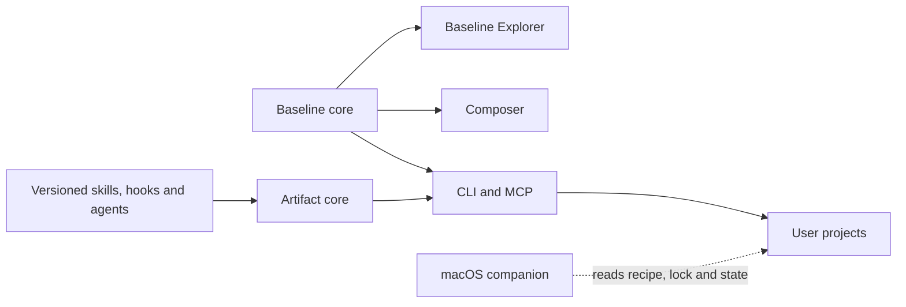

# The release that rebuilt Calavera

_How a plan to version a handful of agent skills became a monorepo, two new applications, eighteen
independently published packages, four prereleases, and the most carefully rehearsed release I have
ever shipped._

I thought I was going to add versioning to Calavera's agent skills.

That sentence now feels almost comically small.

By the time [Calavera 2.3.0](https://github.com/schalkneethling/create-project-calavera/releases/tag/v2.3.0)
reached npm, the project had become a pnpm monorepo with independent release boundaries, a Baseline
Target Explorer, package-backed skills, hooks and agents, a macOS update companion, a shared artifact
resolver, a shared Baseline engine, and a publication pipeline built around npm trusted publishing
and signed provenance.

The final release contained eighteen public packages. The CLI moved to `2.3.0`; seventeen new shared
and artifact packages reached `0.2.0`. The stable publish completed without a long-lived npm token and
produced a signed provenance statement for every package.

That is the clean summary. The useful story is everything that had to happen before it.

## A plan large enough to be dangerous

The original idea was sound: Calavera bundled useful skills, hooks and an agent, but their lifecycle
was tied to the CLI. Updating one meant releasing everything. A manifest, catalog and lockfile could
give each artifact its own identity and version.

Then the adjacent requirements arrived.

If artifacts were independently published, the repository needed real package boundaries. If those
boundaries existed, shared Baseline recommendation logic should not live inside one UI. If projects
could hold exact artifact versions, users needed status, doctor, migration and targeted update
commands. If updates became independently available, a read-only menu-bar companion could notify
people without modifying their projects.

The implementation plan grew into seven phases:

1. Define architecture and public contracts.
2. Convert the repository into a monorepo without changing behavior.
3. Build the Baseline MVP.
4. Extract independently versioned artifacts.
5. Add the package-backed artifact lifecycle.
6. Build the optional macOS companion.
7. Rehearse the combined release journey.

The plan was coherent, but reviewing it as one pull request would have been reckless. The first
important decision was therefore not architectural. It was about how to make the work reviewable.

## The `next` branch became a release train

I created `next` from `main`, then stacked branches in dependency order. Each branch targeted `next`.
After it merged, `next` flowed into the following branch before that branch opened for review.

That gave us a repeated rhythm:

```text
main
  └── next
       └── phase branch 1
            └── phase branch 2
                 └── phase branch 3
```

The diagram is less important than the behavior it enabled. Every phase could be reviewed and tested
as a bounded change. The integrated result remained available on `next`. `main` stayed stable until
the complete system had been exercised.

This also gave manual testing somewhere to live. For a change this large, "the tests pass" was
necessary but nowhere near sufficient. I wanted to switch between increments, use the applications,
inspect generated files, try dry runs, edit managed files deliberately, and confirm cleanup behavior.

The branch train made that possible without turning the final merge into an archaeology exercise.

## Move first, then change

The monorepo phase was intentionally boring.

The existing CLI and MCP server moved into `packages/cli`. The Composer moved into `apps/composer`.
Empty boundaries were established for the Baseline Explorer, menu-bar app, shared Baseline code,
artifact infrastructure, and the eventual artifact packages.

For readers who have not seen Calavera's repository, the important relationships now look like this:



The applications can deploy independently. The shared packages contain reusable domain behavior.
The CLI remains the only surface in this diagram that installs tooling into a project; the menu-bar
companion is deliberately read-only.

The public package name, commands, binaries, schema URL and Composer behavior were preserved. CI
learned how to test, build, pack and release workspace packages independently.
[Changesets](https://github.com/changesets/changesets) was configured for independent versions rather
than one synchronized monorepo number.

That separation mattered later. When failures appeared, we could tell whether they belonged to the
repository move, a product capability, or the release system. Mixing all three would have made every
diagnosis harder. The fewer variables involved in each failure, the easier it was to find the actual
cause.

## Baseline was the vertical slice

The Baseline Target Explorer became the first proof that the new boundaries worked.

`@schalkneethling/calavera-baseline-core` consumes pinned WebDX data, generates a deterministic
CSS-focused snapshot, and exposes pure recommendation functions. The Explorer can explain Widely,
Newly and fixed-year Baseline targets or recommend the earliest target for a set of CSS features. It
turns the same decision into browser versions, a Stylelint rule, Stylelint configuration and a
Calavera recipe.

The CLI, Composer, MCP and WebMCP all consume the same recommendation model. That parity was a release
contract, not an aspiration.

The test suite already covers the pinned data cutoff, moving and fixed targets, approximate dates,
Limited availability, earliest-target recommendations, browser mappings, generated Stylelint rules,
recipe options, schema validation, MCP results and browser keyboard behavior. Sharing an
implementation is helpful, but it is not enough evidence by itself. I opened
[#358](https://github.com/schalkneethling/create-project-calavera/issues/358) to turn representative
recommendations into an explicit fixture matrix across every public surface.

Dogfooding also raised a broader product question. An agent may be better served by deterministic CLI
commands for project work, while MCP concentrates on discovery and natural-language questions such
as "Which linters support TypeScript?" I recorded that CLI/MCP/WebMCP responsibility review in
[#354](https://github.com/schalkneethling/create-project-calavera/issues/354) rather than changing the
public tools as part of a release article.

The UI itself received the kind of scrutiny that broad plans often postpone. We replaced output
controls with the WAI-ARIA Authoring Practices tabs pattern, moved keyboard behavior into Playwright
coverage, removed unsafe `innerHTML` rendering, normalized dates to UTC, and iterated on the visual
hierarchy through direct browser feedback.

Baseline also taught us an important data lesson: reproducible builds need a pinned time boundary.
Deriving "current year" from the wall clock made identical source inputs produce different snapshots.
The generator now uses a checked-in snapshot year and cutoff date, and rejects future data.

## An artifact is not a dependency

The artifact work made a deliberate distinction between distributing an artifact and installing a
project dependency.

Calavera now publishes each maintained skill, hook and agent as its own npm package. A package carries
one payload and one `calavera-artifact.json` manifest. The manifest declares stable identity, type,
payload path, supported targets when applicable, and compatible CLI range.

Consumer projects do not gain those packages in `package.json` or `node_modules`. Calavera resolves
registry metadata and tarballs, verifies npm integrity, package identity, manifest compatibility and
payload hashes, then installs the managed output into the project. Exact resolutions live in
`.calavera/artifacts.lock.json`, which records what package version should be installed. Installed
hashes and ownership remain in `.calavera/state.json`, which records what Calavera may safely update
or remove.

The dedicated manifest has already earned its keep: it separates artifact identity from npm package
identity, validates hook and agent targets, declares CLI compatibility, and gives catalog generation
and payload verification one contract. It is still worth asking whether some of that data belongs in
`package.json` instead. [#355](https://github.com/schalkneethling/create-project-calavera/issues/355)
captures that pros-and-cons review before the current format becomes an unquestioned convention.

That separation made several promises possible:

- ordinary `apply` uses exact locked versions;
- only an explicit artifact update advances a version;
- status remains offline unless update checking is requested;
- verified cached tarballs support locked offline installs;
- local edits block unsafe overwrites;
- one artifact can update without moving the CLI or another artifact.

Hooks exposed a subtle version of the same problem. A hook is not only its script; it can also create a
settings fragment. Both paths have to participate in ownership, dry-run reporting, state tracking and
cleanup. Treating the sidecar as incidental would have made status lie and cleanup incomplete.

## The UI can be newer than the package

During the work, a real user hit `stylelint-logical-css` drift: the hosted Composer and schema offered
an integration that the published CLI did not know how to apply.

The immediate catalog fix was straightforward. The durable lesson was about independent deployment.
Static applications can reach production before their supporting npm package. Sharing source code
does not eliminate that timing gap.

Calavera now gives post-`2.2` integrations a minimum CLI version. The Composer filters choices against
the published CLI rather than assuming that whatever exists in its source tree is already available
to every user.

That is a pattern I will reuse: when two surfaces deploy independently, compatibility needs to be
represented in data, not implied by repository proximity.

## Manual testing became a conversation

The release rehearsal was deliberately incremental.

We started with a minimal recipe in a temporary project, previewed it, applied it, inspected
`.editorconfig`, `package.json` and managed state, then applied it again. The second application
normalized an obsolete state field; the third was byte-for-byte stable.

We removed the integration and exercised cleanup in three modes:

- dry run reported the planned deletion;
- a local edit changed the result to a protected skip;
- restoring the managed content allowed safe removal.

That small workflow caught a human-output bug: JSON dry-run output listed the deletion, but the
human-readable result only said that nothing had been removed. The code was doing the right thing and
the interface was hiding it. We fixed the message and added a regression test.

The same care applied beyond that small fixture:

- updating one artifact had to change only that artifact's exact lock entry;
- a corrupt or mismatched tarball had to fail before any project file changed;
- a missing or locally edited hook settings sidecar had to make artifact status unhealthy;
- Explorer tabs had to support Arrow, Home, End, Enter and Space in a real browser;
- the menu-bar app had to copy the update command even when a preferred terminal could not be opened.

A release checklist is most valuable when it describes what a person should observe, not merely which
command should exit zero. This is also the kind of care I wrote about in
[Do we no longer care about the code?](https://schalkneethling.com/posts/do-we-no-longer-care-about-the-code/):
understanding and testing the system well enough to find where it is wrong, where it falls short, or
where a technically correct result still creates a poor experience.

## Respecting work already in flight

Before merging `next`, there was an older contributor pull request from Theo Ephraim adding Varlock
support.

Dropping a rearchitecture onto a contributor's branch is an easy way to turn a generous contribution
into unpaid migration work. We first offered help and waited. After three days, we brought the change
into `next` ourselves while preserving Theo's authorship and credit.

The generated GitHub release notes later called out Theo as a new contributor. That detail matters.
Architecture is not only about code boundaries; it is also about making change survivable for the
people around a project.

## The release pipeline had its own release

The integrated code passed review and rehearsal. Publishing still took four prereleases.

### Before `next.0`: automation could not open the version PR

Changesets generated the version commit and pushed `changeset-release/main`, then GitHub rejected the
attempt to create a pull request. Repository Actions were not allowed to create PRs.

The workflow had already done the versioning work correctly; the failure happened at the GitHub API
boundary. In the repository's Actions settings, we enabled the permission that allows GitHub Actions
to create pull requests. The fix was a repository setting, not a broader workflow token or a
personal-access token. After the gate was enabled, the same release automation could create its
reviewable version PR normally.

### `next.0`: the package artifact did not exist where CI expected it

The build packed successfully, but the upload step looked for `package/*.tgz` and found nothing.
Packing and uploading used different destination assumptions.

We fixed the workflow so every public package group packs into the same `package` directory consumed
by the artifact upload. `scripts/check-release-contracts.mjs` now asserts that the pack destination
and `actions/upload-artifact` path agree, so a future drift fails during ordinary repository checks
instead of after a release is published.

### `next.1`: first publication met provenance reality

The new packages needed to exist on npm before trusted publishers could be configured for them. We
used a tightly scoped bootstrap path for the first candidate, then hit a provenance failure on the
Baseline package because the repository metadata inside its packed manifest was not acceptable to
npm's source verification.

The useful word there is _packed_. The source `package.json` is not the final evidence. We inspected
the actual archive:

```bash
tar -xOf \
  package/schalkneethling-calavera-baseline-core-0.2.0-next.1.tgz \
  package/package.json
```

That exposed the metadata npm was evaluating. We corrected the canonical repository URL and monorepo
directory, then extended the release contract so every public package must declare repository
metadata that matches its workspace. The check became deterministic before we produced another
candidate.

### `next.2`: bootstrap succeeded

The complete cohort published. That let us configure npm trusted publishing for all seventeen new
packages; the root CLI already had it.

Then we removed the token fallback from the workflow, deleted the GitHub environment secret, revoked
the npm token, and tightened npm publishing access. The bootstrap credential did its one job and
stopped existing.

This is where [Fledgling](https://github.com/dmno-dev/fledgling) would have saved the most time. Instead
of configuring the same trusted publisher manually across seventeen packages, it could have claimed
the imminent package names, applied the shared workflow and protected-environment configuration, and
then reported any remaining trust drift.

### `next.3`: prove OIDC, do not assume it

The final candidate published all eighteen packages through OIDC alone. Each package received signed
provenance. We verified the `next` dist-tags, installed the exact CLI, checked package metadata and
confirmed there was no hidden token fallback.

Only then did we consider stable promotion.

## Even the stable version PR needed review

Exiting Changesets prerelease mode should have produced eighteen stable package updates. An isolated
simulation showed two extra changes:

- Composer gained `"version": null` and a changelog;
- the private menu-bar app moved from `0.1.0` to `0.1.1` and gained a changelog.

Both applications were private and excluded from Changesets. An exit-mode edge case still pulled them
into the generated plan.

We did not edit the real release blindly. We reproduced the behavior in a disposable copy, changed
only `.changeset/pre.json` in the promotion PR, then removed the four private-app files from the
automated stable version PR. After that correction, the diff contained exactly the intended public
cohort.

This was a useful final reminder: generated release PRs are code. Review them.

## The stable release

On the exact merge commit we ran:

- a frozen-lockfile install;
- the complete release rehearsal;
- the pinned workflow security audit;
- Changesets status;
- a clean pack of all eighteen packages;
- embedded manifest inspection;
- an exact-version npm absence check;
- a consumer-side `2.3.0` CLI smoke test.

The GitHub release began as a draft targeting the recorded commit. We verified the tag, title, notes,
target and stable—not prerelease—state before publishing it.

The resulting workflow kept test, build and publish in separate jobs. The build job produced and
uploaded the tarballs. The protected publish job downloaded those artifacts, requested its OIDC
identity, rejected registry failures that were not explicit missing-version responses, and published
the cohort.

Afterward we verified all eighteen `latest` tags, confirmed every `next` tag still pointed to
`next.3`, checked eighteen provenance statements, resolved the stable CLI from npm, and ran it outside
the workspace.

Then, finally, we cleaned up the temporary tarballs and confirmed the worktree was clean. The pack
inventory, embedded-manifest checks, exact-version registry probes, dist-tag comparison, provenance
count and cleanup are all deterministic enough to become a reusable tool rather than a collection of
carefully reconstructed shell commands. That follow-up is now
[#357](https://github.com/schalkneethling/create-project-calavera/issues/357).

## One tool I will likely bring to the next release

I learned about [Fledgling](https://github.com/dmno-dev/fledgling) after completing this release. It
focuses on exactly the awkward bootstrap loop we handled manually: claiming new npm package names,
configuring OIDC trusted publishers, and reconciling that configuration across a monorepo.

For Calavera, it could have claimed the seventeen new package names with minimal placeholders,
configured each one against the same GitHub workflow and protected `publish` environment, and then
been rerun idempotently as the cohort came online. Its `sync` flow would also have given us a useful
feedback loop before removing the bootstrap token and again before the token-free `next.3` candidate:
show the actual npm trust configuration, compare it with the repository's intended configuration,
apply only approved differences, then require a no-drift result.

It would not have found the missing tarball upload, the packed provenance metadata problem, the
GitHub Actions PR permission, or the Changesets private-app edge case. Those remain independent
release gates. Fledgling would have made one fragile part of the journey easier; it would not have
made the rest of the rehearsal unnecessary.

I will likely use it next time, but with the same constraints this release taught me to value: pin and
review the tool version, inspect its plan first, keep a human confirmation before it claims names or
changes trust, avoid moving `latest` with a placeholder unintentionally, and keep Changesets, package
inspection, provenance and registry verification as separate evidence.

## What I will carry into the next release

The biggest lesson is that a release is a product workflow. It has users, interfaces, failure states,
security boundaries and recovery semantics.

More concretely:

1. **Break architecture into reviewable transitions.** A branch train made a huge change
   understandable without hiding the integrated result.
2. **Model deployment timing explicitly.** A shared repository does not make a hosted UI and an npm
   package appear simultaneously.
3. **Inspect the thing you publish.** Tarballs, generated version PRs and release metadata are better
   evidence than source intent.
4. **Treat manual testing as design feedback.** The clean dry-run bug was not a logic failure. It was
   an observability failure.
5. **Use prereleases to test the release system.** `next.0` through `next.3` were not wasted versions;
   they were progressively stronger evidence.
6. **Bootstrap credentials should expire from the architecture.** The safe end state was not "the
   token worked." It was "the token is gone."
7. **Make retry safe.** Exact-version checks let a partial multi-package publish resume without
   unpublishing good packages.
8. **Pause before irreversible actions.** Draft releases, explicit approvals and one-step gates kept
   the process inspectable.

I have turned that process into a reusable agent skill alongside this article. The commands will
change from project to project. The discipline should not.

Calavera 2.3.0 is live. It is almost an entirely new architecture, but it still serves the original
goal: make project tooling choices explicit, inspectable and repeatable.

That applies to releases too.
